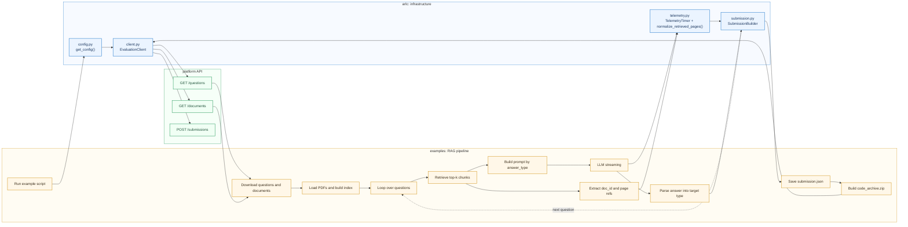

# Starter Kit Flow

This file stores the Mermaid diagram for the current starter kit architecture.
The content is ASCII-only and saved as UTF-8 to avoid encoding issues in VS Code.

```mermaid
flowchart LR

    subgraph EX["examples: RAG pipeline"]
        A["Run example script"]
        B["Download questions and documents"]
        C["Load PDFs and build index"]
        D["Loop over questions"]
        E["Retrieve top-k chunks"]
        F["Build prompt by answer_type"]
        G["LLM streaming"]
        H["Parse answer into target type"]
        I["Extract doc_id and page refs"]
        J["Save submission.json"]
        K["Build code_archive.zip"]
    end

    subgraph CORE["arlc: infrastructure"]
        C1["config.py<br/>get_config()"]
        C2["client.py<br/>EvaluationClient"]
        C3["telemetry.py<br/>TelemetryTimer + normalize_retrieved_pages()"]
        C4["submission.py<br/>SubmissionBuilder"]
    end

    subgraph API["platform API"]
        P1["GET /questions"]
        P2["GET /documents"]
        P3["POST /submissions"]
    end

    A --> C1 --> C2
    C2 --> P1
    C2 --> P2
    P1 --> B
    P2 --> B
    B --> C --> D
    D --> E --> F --> G --> H
    E --> I
    G --> C3
    I --> C3
    H --> C4
    C3 --> C4
    C4 -. next question .-> D
    C4 --> J --> K --> C2
    C2 --> P3

    classDef ex fill:#FFF7E8,stroke:#D69E2E,stroke-width:1.5px,color:#3B2F1B;
    classDef core fill:#EBF4FF,stroke:#3182CE,stroke-width:1.5px,color:#1A365D;
    classDef api fill:#F0FFF4,stroke:#38A169,stroke-width:1.5px,color:#22543D;

    class A,B,C,D,E,F,G,H,I,J,K ex;
    class C1,C2,C3,C4 core;
    class P1,P2,P3 api;

    style EX fill:#FFFCF3,stroke:#D69E2E,stroke-width:1px
    style CORE fill:#F7FAFF,stroke:#3182CE,stroke-width:1px
    style API fill:#F6FFF8,stroke:#38A169,stroke-width:1px
```
